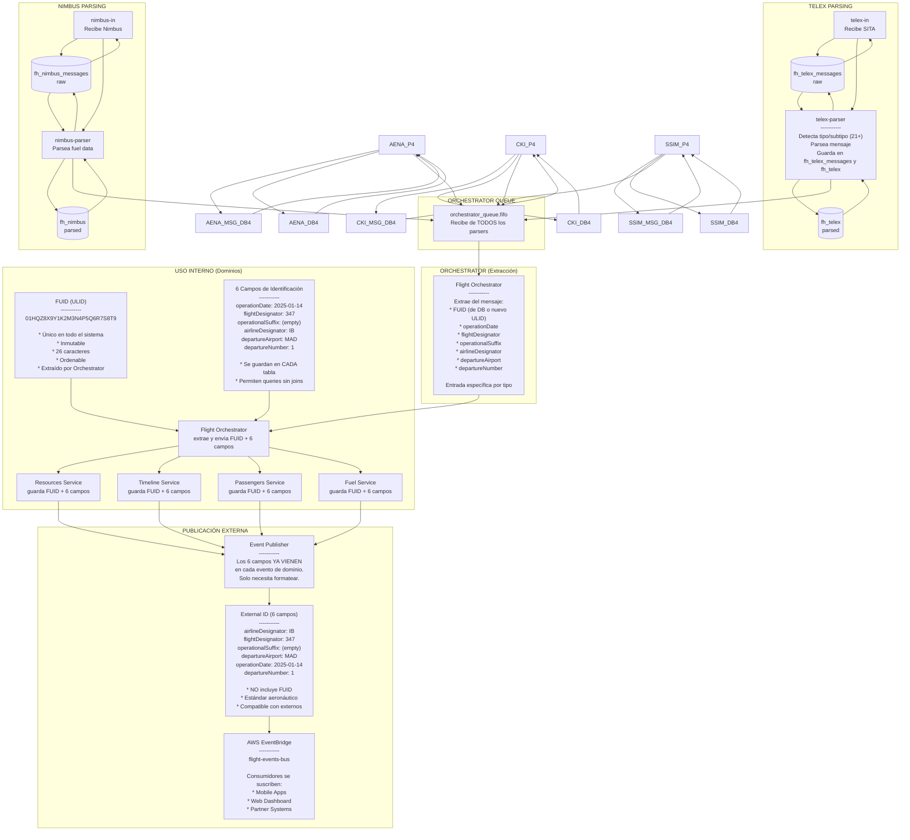

## 2. Nueva Arquitectura (Basada en Dominios)


**Beneficios Clave**:

- ✅ **Arquitectura IN → Parser → Orchestrator**: Flujo claro y separado (telex-in → telex-parser, nimbus-in → nimbus-parser, etc.)
- ✅ **Servicios IN dedicados**: Cada fuente tiene su servicio de ingesta (telex-in, nimbus-in, aena-in, cki-in, ssim-in)
- ✅ **Parsers con BD propia**: Cada parser guarda en su base de datos (fh_telex, fh_nimbus, fh_aena, fh_cki, fh_ssim)
- ✅ **Telex Parser unificado**: Un solo parser procesa los 21+ tipos de mensajes telex
- ✅ **Auditoría completa**: Todos los mensajes parseados se guardan antes de enviar al orchestrator
- ✅ **Cola única del orchestrator**: `orchestrator_queue.fifo` recibe de TODOS los parsers
- ✅ **Flight Orchestrator**: Extrae FUID + 6 campos con entrada específica por tipo de dato
- ✅ **13 dominios granulares**: Resources, Timeline, Delays, Crew, Alerts, Passengers, Baggage, Fuel, Aircraft, Schedules, Onward Flights, Codeshare
- ✅ **Dominios independientes** con sus propias tablas o bases de datos
- ✅ **FUID único** (ULID) para uso interno
- ✅ **6 campos de identificación** se guardan en cada tabla de dominio
- ✅ **Event Publisher** usa solo los 6 campos (NO publica FUID a EventBridge)
- ✅ **Prefijos consistentes**: `fh_resource_`, `fh_timeline_`, `fh_delay_`, `fh_crew_`, `fh_alert_`, `fh_pax_`, `fh_bag_`, `fh_fuel_`, etc.
- ✅ Escalado independiente por parser y por dominio
- ✅ Deploys independientes
- ✅ Matching flexible (IATA/ICAO)

---

## 3. Flujo de Datos: Mensaje MVT Completo


---

## 4. Identificadores: FUID + 6 Campos de Identificación



---

 Comparación: Tabla flight_departure_info

### Arquitectura Actual (Monolítica)


### Nueva Arquitectura (Separada por Dominios)


---

## 6. Los 6 Campos de Identificación en Cada Tabla

Cada tabla de dominio guarda estos 6 campos para permitir queries directas sin joins:

```typescript
interface FlightIdentifiers {
  operationDate: Date; // 2025-01-14
  flightDesignator: string; // "347"
  operationalSuffix: string; // "" o "A", "B"
  airlineDesignator: string; // "IB"
  departureAirport: string; // "MAD"
  departureNumber: number; // 1, 2, 3... (turnarounds)
}
```

**Ejemplo en tabla `passenger_summary`:**

```sql
CREATE TABLE passenger_summary (
  id UUID PRIMARY KEY,
  fuid VARCHAR(26) NOT NULL,

  -- Los 6 campos de identificación
  operation_date DATE NOT NULL,
  flight_designator VARCHAR(10) NOT NULL,
  operational_suffix VARCHAR(3) DEFAULT '',
  airline_designator VARCHAR(3) NOT NULL,
  departure_airport VARCHAR(3) NOT NULL,
  departure_number INTEGER NOT NULL DEFAULT 1,

  -- Datos de pasajeros
  total_passengers INTEGER,
  checked_in_passengers INTEGER,
  boarded_passengers INTEGER,
  -- ...

  -- Índices
  INDEX idx_fuid (fuid),
  INDEX idx_flight_id (airline_designator, flight_designator, operation_date, departure_airport)
);
```

**Beneficios:**

- ✅ Queries sin joins: `SELECT * FROM passenger_summary WHERE airline_designator='IB' AND flight_designator='347' AND operation_date='2025-01-14'`
- ✅ Cada dominio es independiente
- ✅ Event Publisher recibe los 6 campos directamente en cada evento

---

## 7. Onward Flights y departureNumber


**Explicación**:

- El FUID permanece **igual** (mismo vuelo)
- El `departure_number` se **incrementa** (1 → 2)
- El dominio **Onward Flights** registra la relación entre el vuelo entrante y el siguiente
- Los eventos externos incluyen `departureNumber` para diferenciar
- El campo `fuid_flight_principal` referencia al vuelo principal

---

## Resumen de Componentes

| Componente              | Responsabilidad                     | Base de Datos | Identificador Usado             |
| ----------------------- | ----------------------------------- | ------------- | ------------------------------- |
| **telex-in**            | Recibir y guardar mensajes raw desde SITA | fh_telex_messages | Mensaje raw |
| **nimbus-in**           | Recibir y guardar mensajes raw desde Nimbus | fh_nimbus_messages | Mensaje raw |
| **aena-in**             | Recibir y guardar mensajes CDM | fh_aena_messages |
| **cki-in**              | Recibir y guardar mensajes GAUD | fh_cki_messages |
| **ssim-in**             | Recibir y guardar archivos SSIM | fh_ssim_messages | Mensaje raw |
| **Telex Parser**        | Lee de fh_telex_messages, parsea y guarda en fh_telex | fh_telex | Datos parseados solamente |
| **Nimbus Parser**       | Lee de fh_nimbus_messages, parsea y guarda en fh_nimbus | fh_nimbus | Datos parseados solamente    |
| **AENA Parser**         | Lee de fh_aena_messages, parsea y guarda en fh_aena | fh_aena | Datos parseados solamente    |
| **CKI Parser**          | Lee de fh_cki_messages, parsea y guarda en fh_cki | fh_cki | Datos parseados solamente    |
| **SSIM Parser**         | Lee de fh_ssim_messages, parsea y guarda en fh_ssim | fh_ssim | Datos parseados solamente    |
| **Orchestrator Queue**  | Cola FIFO para todos los parsers | N/A | CloudEvents (orden FIFO por SQS) |
| **Flight Orchestrator** | Extraer FUID + 6 campos, routing, precedencias | fh_orchestrator | FUID + 6 campos     |
| **Domain Services** (13)| Lógica de negocio por dominio       | fh_resource, fh_timeline, fh_delay, fh_crew, fh_alert, fh_pax, fh_bag, fh_fuel, fh_aircraft, fh_schedule, fh_onward, fh_codeshare | FUID + 6 campos (guardan ambos) |
| **Event Publisher**     | Formatear y publicar (sin FUID)     | Redis Cache | Solo 6 campos (NO FUID)         |
| **Consumers Externos**  | Recibir eventos                     | N/A | External ID (6 campos, sin FUID)|

**Clave**:

- **Flujo IN → Parser → Orchestrator**: Separación clara de responsabilidades
- **Servicios IN**: Reciben y guardan mensajes raw en fh_[nombre]_messages, luego notifican al parser
- **Parsers**: Cada parser lee de fh_[nombre]_messages, parsea y guarda en fh_[nombre] antes de publicar al orchestrator
  - telex-in → fh_telex_messages (raw)
  - telex-parser → fh_telex (parsed) - 21+ tipos
  - nimbus-in → fh_nimbus_messages (raw)
  - nimbus-parser → fh_nimbus (parsed)
  - aena-in → fh_aena_messages (raw)
  - aena-parser → fh_aena (parsed)
  - cki-in → fh_cki_messages (raw)
  - cki-parser → fh_cki (parsed)
  - ssim-in → fh_ssim_messages (raw)
  - ssim-parser → fh_ssim (parsed)
- **Cola única del orchestrator**: `orchestrator_queue.fifo` recibe de TODOS los parsers
- **Flight Orchestrator** extrae FUID + 6 campos con entrada específica por tipo de dato
- **6 campos en cada tabla**: Cada dominio guarda FUID + 6 campos
- **Event Publisher** recibe los 6 campos ya en cada evento, NO publica FUID a EventBridge
- **Queries sin joins**: Los 6 campos permiten buscar vuelos en cualquier tabla de dominio
- **Escalabilidad por parser**: Cada parser escala según su carga específica
- **Auditoría completa**: Todos los mensajes parseados se guardan antes del orchestrator
